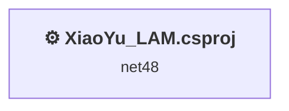
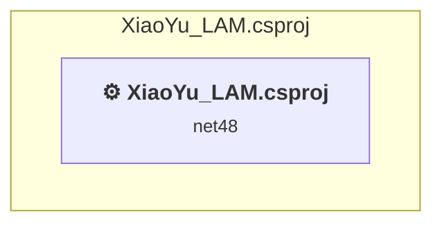

# Projects and dependencies analysis

This document provides a comprehensive overview of the projects and their dependencies in the context of upgrading to .NETCoreApp,Version=v10.0.

## Table of Contents

- [Executive Summary](#executive-Summary)
  - [Highlevel Metrics](#highlevel-metrics)
  - [Projects Compatibility](#projects-compatibility)
  - [Package Compatibility](#package-compatibility)
  - [API Compatibility](#api-compatibility)
- [Aggregate NuGet packages details](#aggregate-nuget-packages-details)
- [Top API Migration Challenges](#top-api-migration-challenges)
  - [Technologies and Features](#technologies-and-features)
  - [Most Frequent API Issues](#most-frequent-api-issues)
- [Projects Relationship Graph](#projects-relationship-graph)
- [Project Details](#project-details)

  - [XiaoYu_LAM.csproj](#xiaoyu_lamcsproj)

## Executive Summary

### Highlevel Metrics

| Metric | Count | Status |
| :--- | :---: | :--- |
| Total Projects | 1 | All require upgrade |
| Total NuGet Packages | 37 | 7 need upgrade |
| Total Code Files | 18 |  |
| Total Code Files with Incidents | 16 |  |
| Total Lines of Code | 4365 |  |
| Total Number of Issues | 2729 |  |
| Estimated LOC to modify | 2715+ | at least 62.2% of codebase |

### Projects Compatibility

| Project | Target Framework | Difficulty | Package Issues | API Issues | Est. LOC Impact | Description |
| :--- | :---: | :---: | :---: | :---: | :---: | :--- |
| [XiaoYu_LAM.csproj](#xiaoyu_lamcsproj) | net48 | 🟡 Medium | 12 | 2715 | 2715+ | ClassicWpf, Sdk Style = False |

### Package Compatibility

| Status | Count | Percentage |
| :--- | :---: | :---: |
| ✅ Compatible | 30 | 81.1% |
| ⚠️ Incompatible | 3 | 8.1% |
| 🔄 Upgrade Recommended | 4 | 10.8% |
| ***Total NuGet Packages*** | ***37*** | ***100%*** |

### API Compatibility

| Category | Count | Impact |
| :--- | :---: | :--- |
| 🔴 Binary Incompatible | 2418 | High - Require code changes |
| 🟡 Source Incompatible | 286 | Medium - Needs re-compilation and potential conflicting API error fixing |
| 🔵 Behavioral change | 11 | Low - Behavioral changes that may require testing at runtime |
| ✅ Compatible | 3721 |  |
| ***Total APIs Analyzed*** | ***6436*** |  |

## Aggregate NuGet packages details

| Package | Current Version | Suggested Version | Projects | Description |
| :--- | :---: | :---: | :--- | :--- |
| Anthropic | 12.8.0 |  | [XiaoYu_LAM.csproj](#xiaoyu_lamcsproj) | ✅Compatible |
| FlaUI.Core | 5.0.0 | 4.0.0 | [XiaoYu_LAM.csproj](#xiaoyu_lamcsproj) | ⚠️NuGet 包不兼容 |
| FlaUI.UIA2 | 5.0.0 | 4.0.0 | [XiaoYu_LAM.csproj](#xiaoyu_lamcsproj) | ⚠️NuGet 包不兼容 |
| FlaUI.UIA3 | 5.0.0 | 4.0.0 | [XiaoYu_LAM.csproj](#xiaoyu_lamcsproj) | ⚠️NuGet 包不兼容 |
| Interop.UIAutomationClient | 10.19041.0 |  | [XiaoYu_LAM.csproj](#xiaoyu_lamcsproj) | ✅Compatible |
| Microsoft.Agents.AI | 1.0.0-rc2 |  | [XiaoYu_LAM.csproj](#xiaoyu_lamcsproj) | ✅Compatible |
| Microsoft.Agents.AI.Abstractions | 1.0.0-rc2 |  | [XiaoYu_LAM.csproj](#xiaoyu_lamcsproj) | ✅Compatible |
| Microsoft.Agents.AI.OpenAI | 1.0.0-rc2 |  | [XiaoYu_LAM.csproj](#xiaoyu_lamcsproj) | ✅Compatible |
| Microsoft.Bcl.AsyncInterfaces | 10.0.3 |  | [XiaoYu_LAM.csproj](#xiaoyu_lamcsproj) | ✅Compatible |
| Microsoft.Bcl.Numerics | 10.0.3 |  | [XiaoYu_LAM.csproj](#xiaoyu_lamcsproj) | ✅Compatible |
| Microsoft.Extensions.AI | 10.3.0 |  | [XiaoYu_LAM.csproj](#xiaoyu_lamcsproj) | ✅Compatible |
| Microsoft.Extensions.AI.Abstractions | 10.3.0 |  | [XiaoYu_LAM.csproj](#xiaoyu_lamcsproj) | ✅Compatible |
| Microsoft.Extensions.AI.OpenAI | 10.3.0 |  | [XiaoYu_LAM.csproj](#xiaoyu_lamcsproj) | ✅Compatible |
| Microsoft.Extensions.Caching.Abstractions | 10.0.3 |  | [XiaoYu_LAM.csproj](#xiaoyu_lamcsproj) | ✅Compatible |
| Microsoft.Extensions.DependencyInjection.Abstractions | 10.0.3 |  | [XiaoYu_LAM.csproj](#xiaoyu_lamcsproj) | ✅Compatible |
| Microsoft.Extensions.Logging.Abstractions | 10.0.3 |  | [XiaoYu_LAM.csproj](#xiaoyu_lamcsproj) | ✅Compatible |
| Microsoft.Extensions.Primitives | 10.0.3 |  | [XiaoYu_LAM.csproj](#xiaoyu_lamcsproj) | ✅Compatible |
| Microsoft.Extensions.VectorData.Abstractions | 9.7.0 |  | [XiaoYu_LAM.csproj](#xiaoyu_lamcsproj) | ✅Compatible |
| OpenAI | 2.8.0 |  | [XiaoYu_LAM.csproj](#xiaoyu_lamcsproj) | ✅Compatible |
| System.Buffers | 4.6.1 |  | [XiaoYu_LAM.csproj](#xiaoyu_lamcsproj) | 框架引用中包含 NuGet 包功能 |
| System.ClientModel | 1.8.1 |  | [XiaoYu_LAM.csproj](#xiaoyu_lamcsproj) | ✅Compatible |
| System.CodeDom | 8.0.0 | 10.0.3 | [XiaoYu_LAM.csproj](#xiaoyu_lamcsproj) | 建议升级 NuGet 包 |
| System.Collections.Immutable | 8.0.0 | 10.0.3 | [XiaoYu_LAM.csproj](#xiaoyu_lamcsproj) | 建议升级 NuGet 包 |
| System.Diagnostics.DiagnosticSource | 10.0.3 |  | [XiaoYu_LAM.csproj](#xiaoyu_lamcsproj) | ✅Compatible |
| System.IO.Pipelines | 10.0.3 |  | [XiaoYu_LAM.csproj](#xiaoyu_lamcsproj) | ✅Compatible |
| System.Management | 8.0.0 | 10.0.3 | [XiaoYu_LAM.csproj](#xiaoyu_lamcsproj) | 建议升级 NuGet 包 |
| System.Memory | 4.6.3 |  | [XiaoYu_LAM.csproj](#xiaoyu_lamcsproj) | 框架引用中包含 NuGet 包功能 |
| System.Memory.Data | 8.0.1 | 10.0.3 | [XiaoYu_LAM.csproj](#xiaoyu_lamcsproj) | 建议升级 NuGet 包 |
| System.Net.ServerSentEvents | 10.0.3 |  | [XiaoYu_LAM.csproj](#xiaoyu_lamcsproj) | ✅Compatible |
| System.Numerics.Tensors | 10.0.3 |  | [XiaoYu_LAM.csproj](#xiaoyu_lamcsproj) | ✅Compatible |
| System.Numerics.Vectors | 4.6.1 |  | [XiaoYu_LAM.csproj](#xiaoyu_lamcsproj) | 框架引用中包含 NuGet 包功能 |
| System.Runtime.CompilerServices.Unsafe | 6.1.2 |  | [XiaoYu_LAM.csproj](#xiaoyu_lamcsproj) | ✅Compatible |
| System.Text.Encodings.Web | 10.0.3 |  | [XiaoYu_LAM.csproj](#xiaoyu_lamcsproj) | ✅Compatible |
| System.Text.Json | 10.0.3 |  | [XiaoYu_LAM.csproj](#xiaoyu_lamcsproj) | ✅Compatible |
| System.Threading.Channels | 10.0.3 |  | [XiaoYu_LAM.csproj](#xiaoyu_lamcsproj) | ✅Compatible |
| System.Threading.Tasks.Extensions | 4.6.3 |  | [XiaoYu_LAM.csproj](#xiaoyu_lamcsproj) | 框架引用中包含 NuGet 包功能 |
| System.ValueTuple | 4.6.1 |  | [XiaoYu_LAM.csproj](#xiaoyu_lamcsproj) | 框架引用中包含 NuGet 包功能 |

## Top API Migration Challenges

### Technologies and Features

| Technology | Issues | Percentage | Migration Path |
| :--- | :---: | :---: | :--- |
| Windows Forms | 2364 | 87.1% | Windows Forms APIs for building Windows desktop applications with traditional Forms-based UI that are available in .NET on Windows. Enable Windows Desktop support: Option 1 (Recommended): Target net9.0-windows; Option 2: Add <UseWindowsDesktop>true</UseWindowsDesktop>; Option 3 (Legacy): Use Microsoft.NET.Sdk.WindowsDesktop SDK. |
| GDI+ / System.Drawing | 275 | 10.1% | System.Drawing APIs for 2D graphics, imaging, and printing that are available via NuGet package System.Drawing.Common. Note: Not recommended for server scenarios due to Windows dependencies; consider cross-platform alternatives like SkiaSharp or ImageSharp for new code. |
| Legacy Configuration System | 2 | 0.1% | Legacy XML-based configuration system (app.config/web.config) that has been replaced by a more flexible configuration model in .NET Core. The old system was rigid and XML-based. Migrate to Microsoft.Extensions.Configuration with JSON/environment variables; use System.Configuration.ConfigurationManager NuGet package as interim bridge if needed. |

### Most Frequent API Issues

| API | Count | Percentage | Category |
| :--- | :---: | :---: | :--- |
| T:System.Windows.Forms.Button | 155 | 5.7% | Binary Incompatible |
| T:System.Windows.Forms.Label | 130 | 4.8% | Binary Incompatible |
| T:System.Windows.Forms.ToolStripMenuItem | 126 | 4.6% | Binary Incompatible |
| T:System.Windows.Forms.TabPage | 87 | 3.2% | Binary Incompatible |
| T:System.Windows.Forms.GroupBox | 71 | 2.6% | Binary Incompatible |
| T:System.Windows.Forms.TextBox | 67 | 2.5% | Binary Incompatible |
| P:System.Windows.Forms.Control.Name | 66 | 2.4% | Binary Incompatible |
| T:System.Windows.Forms.Control.ControlCollection | 61 | 2.2% | Binary Incompatible |
| P:System.Windows.Forms.Control.Controls | 61 | 2.2% | Binary Incompatible |
| M:System.Windows.Forms.Control.ControlCollection.Add(System.Windows.Forms.Control) | 61 | 2.2% | Binary Incompatible |
| P:System.Windows.Forms.Control.Size | 61 | 2.2% | Binary Incompatible |
| P:System.Windows.Forms.Control.Location | 54 | 2.0% | Binary Incompatible |
| P:System.Windows.Forms.Control.TabIndex | 52 | 1.9% | Binary Incompatible |
| T:System.Windows.Forms.PictureBox | 50 | 1.8% | Binary Incompatible |
| T:System.Windows.Forms.ToolStripStatusLabel | 50 | 1.8% | Binary Incompatible |
| T:System.Drawing.Bitmap | 48 | 1.8% | Source Incompatible |
| T:System.Windows.Forms.ComboBox | 47 | 1.7% | Binary Incompatible |
| T:System.Windows.Forms.DockStyle | 45 | 1.7% | Binary Incompatible |
| P:System.Windows.Forms.ToolStripItem.Text | 43 | 1.6% | Binary Incompatible |
| T:System.Windows.Forms.RichTextBox | 42 | 1.5% | Binary Incompatible |
| T:System.Windows.Forms.StatusStrip | 39 | 1.4% | Binary Incompatible |
| T:System.Drawing.Font | 36 | 1.3% | Source Incompatible |
| T:System.Windows.Forms.ToolStripButton | 32 | 1.2% | Binary Incompatible |
| T:System.Windows.Forms.ColumnHeader | 30 | 1.1% | Binary Incompatible |
| P:System.Windows.Forms.ToolStripItem.Name | 25 | 0.9% | Binary Incompatible |
| T:System.Drawing.FontStyle | 24 | 0.9% | Source Incompatible |
| P:System.Windows.Forms.ToolStripItem.Size | 24 | 0.9% | Binary Incompatible |
| T:System.Windows.Forms.CheckBox | 24 | 0.9% | Binary Incompatible |
| T:System.Windows.Rect | 22 | 0.8% | Binary Incompatible |
| T:System.Drawing.Image | 22 | 0.8% | Source Incompatible |
| T:System.Windows.Forms.Padding | 20 | 0.7% | Binary Incompatible |
| T:System.Drawing.GraphicsUnit | 20 | 0.7% | Source Incompatible |
| T:System.Windows.Forms.TabControl | 20 | 0.7% | Binary Incompatible |
| M:System.Windows.Forms.Control.ResumeLayout(System.Boolean) | 19 | 0.7% | Binary Incompatible |
| M:System.Windows.Forms.Control.SuspendLayout | 19 | 0.7% | Binary Incompatible |
| P:System.Windows.Forms.ButtonBase.Text | 17 | 0.6% | Binary Incompatible |
| M:System.Windows.Forms.ToolStripMenuItem.#ctor | 17 | 0.6% | Binary Incompatible |
| P:System.Windows.Forms.Control.Font | 16 | 0.6% | Binary Incompatible |
| P:System.Windows.Forms.ButtonBase.UseVisualStyleBackColor | 16 | 0.6% | Binary Incompatible |
| T:System.Windows.Forms.MenuStrip | 16 | 0.6% | Binary Incompatible |
| P:System.Windows.Forms.PictureBox.Image | 16 | 0.6% | Binary Incompatible |
| T:System.Windows.Forms.AutoScaleMode | 15 | 0.6% | Binary Incompatible |
| T:System.Windows.Forms.ListView | 15 | 0.6% | Binary Incompatible |
| M:System.Windows.Forms.Button.#ctor | 14 | 0.5% | Binary Incompatible |
| T:System.Windows.Forms.MessageBoxIcon | 14 | 0.5% | Binary Incompatible |
| T:System.Windows.Forms.MessageBoxButtons | 14 | 0.5% | Binary Incompatible |
| T:System.Windows.Forms.ToolStripLabel | 14 | 0.5% | Binary Incompatible |
| T:System.Windows.Forms.ToolStrip | 14 | 0.5% | Binary Incompatible |
| P:System.Windows.Forms.Control.Dock | 14 | 0.5% | Binary Incompatible |
| P:System.Windows.Forms.Label.AutoSize | 13 | 0.5% | Binary Incompatible |

## Projects Relationship Graph

Legend:
📦 SDK-style project
⚙️ Classic project

## Project Details

### XiaoYu_LAM.csproj

#### Project Info

- **Current Target Framework:** net48
- **Proposed Target Framework:** net10.0-windows
- **SDK-style**: False
- **Project Kind:** ClassicWpf
- **Dependencies**: 0
- **Dependants**: 0
- **Number of Files**: 25
- **Number of Files with Incidents**: 16
- **Lines of Code**: 4365
- **Estimated LOC to modify**: 2715+ (at least 62.2% of the project)

#### Dependency Graph

Legend:
📦 SDK-style project
⚙️ Classic project

### API Compatibility

| Category | Count | Impact |
| :--- | :---: | :--- |
| 🔴 Binary Incompatible | 2418 | High - Require code changes |
| 🟡 Source Incompatible | 286 | Medium - Needs re-compilation and potential conflicting API error fixing |
| 🔵 Behavioral change | 11 | Low - Behavioral changes that may require testing at runtime |
| ✅ Compatible | 3721 |  |
| ***Total APIs Analyzed*** | ***6436*** |  |

#### Project Technologies and Features

| Technology | Issues | Percentage | Migration Path |
| :--- | :---: | :---: | :--- |
| Legacy Configuration System | 2 | 0.1% | Legacy XML-based configuration system (app.config/web.config) that has been replaced by a more flexible configuration model in .NET Core. The old system was rigid and XML-based. Migrate to Microsoft.Extensions.Configuration with JSON/environment variables; use System.Configuration.ConfigurationManager NuGet package as interim bridge if needed. |
| GDI+ / System.Drawing | 275 | 10.1% | System.Drawing APIs for 2D graphics, imaging, and printing that are available via NuGet package System.Drawing.Common. Note: Not recommended for server scenarios due to Windows dependencies; consider cross-platform alternatives like SkiaSharp or ImageSharp for new code. |
| Windows Forms | 2364 | 87.1% | Windows Forms APIs for building Windows desktop applications with traditional Forms-based UI that are available in .NET on Windows. Enable Windows Desktop support: Option 1 (Recommended): Target net9.0-windows; Option 2: Add <UseWindowsDesktop>true</UseWindowsDesktop>; Option 3 (Legacy): Use Microsoft.NET.Sdk.WindowsDesktop SDK. |

